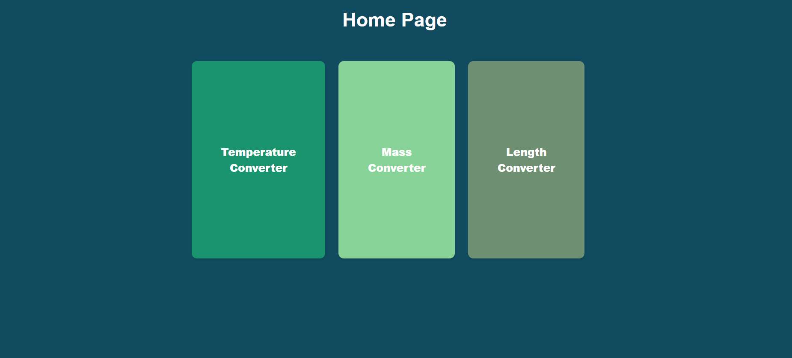
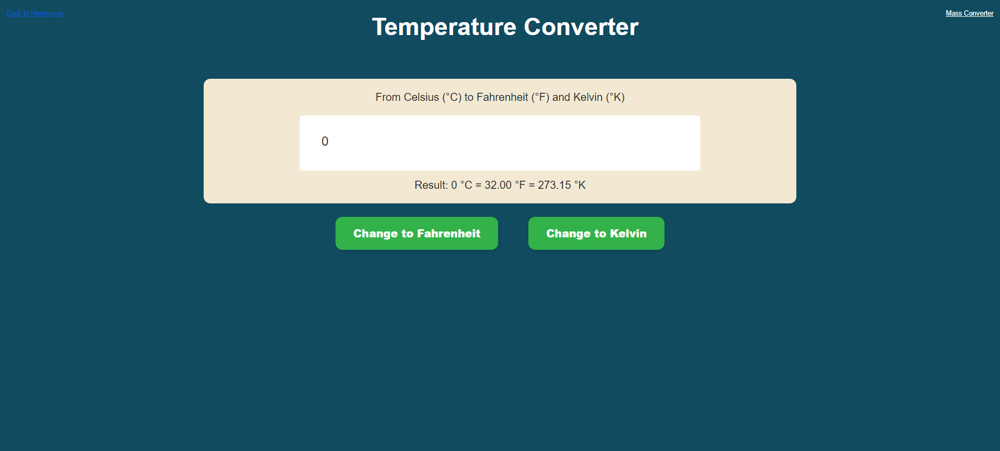
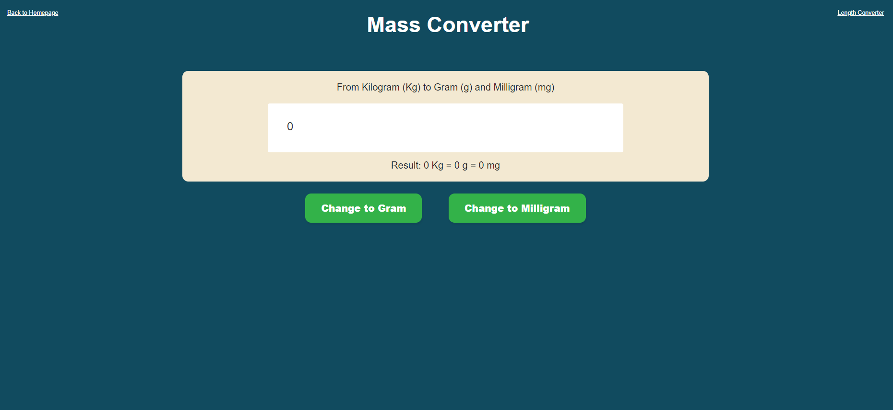
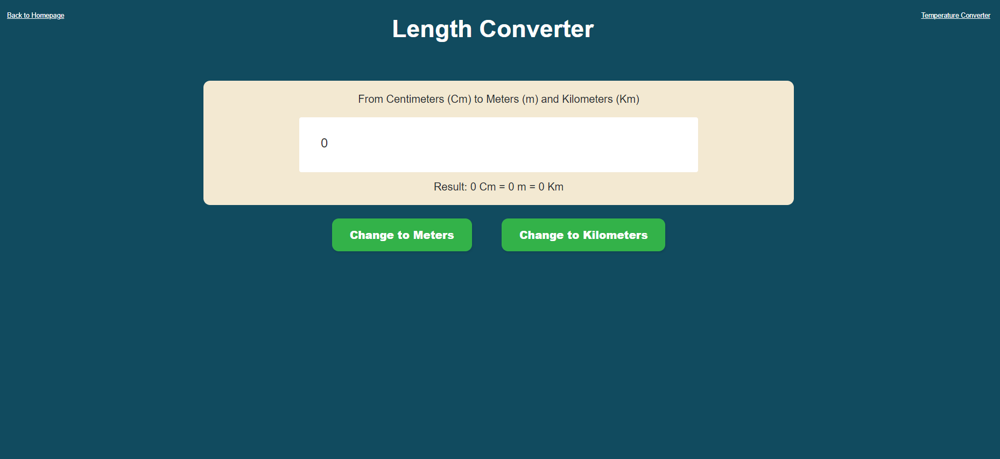

# Conversion Web Application with F#

<a href="Images/HomePage.png">
    
</a>
<a href="Images/TemperatuePage.png">
    
</a>
<a href="Images/MassPage.png">
    
</a>
<a href="Images/LengthPage.png">
    
</a>

This is a simple web application built using F# with WebSharper for converting temperature, mass, and length units.

## Features

- Temperature Conversion: Convert between Celsius, Fahrenheit, and Kelvin.
- Mass Conversion: Convert between Gram, Milligram, and Kilogram.
- Length Conversion: Convert between Centimeter, Meter, and Kilometer.

## Technologies Used

- [F#](https://fsharp.org)
- [WebSharper](https://websharper.com)
- [ASP.NET Core](https://dotnet.microsoft.com/en-us/apps/aspnet)

## Preview

You can see a live preview of the website [here](https://myconverter20240508215832.azurewebsites.net).

## Getting Started

To get a local copy up and running follow these simple steps.

### Prerequisites

Before you start, ensure you have the following installed:

- [.NET Core SDK](https://dotnet.microsoft.com/download)
- [Node.js](https://nodejs.org/)

### Installation

1. Clone the repo
   ```sh
   git clone https://github.com/Got17/Conversion-Web.git
   ```
2. Navigate to the project directory
   ```sh
   cd Conversion-Web
   ```
### Usage

1. Open the project in your favorite code editor.
2. Build the project using the following command:
   ```sh
   dotnet build
   ```
3. Run the project:
   ```sh
   dotnet run
   ```
4. Open your web browser and navigate to [http://localhost:5000](http://localhost:5000) to view the application.

## Project Structure

- `src/`: Contains F# source code files.
- `src/index.html`: HTML template for the application.
- `src/Site.fs`: Client-side F# code.
- `src/Startup.fs`: Server-side F# code.
- `src/Temperature.fs`: Temperature conversion F# code.
- `src/Mass.fs`: Mass conversion F# code.
- `src/Length.fs`: Length conversion F# code.

## Contributing

Contributions are what make the open-source community such an amazing place to learn, inspire, and create. Any contributions you make are **greatly appreciated**.

1. Fork the Project
2. Create your Feature Branch (`git checkout -b feature/AmazingFeature`)
3. Commit your Changes (`git commit -m 'Add some AmazingFeature`)
4. Push to the Branch (`git push origin feature/AmazingFeature`)
5. Open a Pull Request
